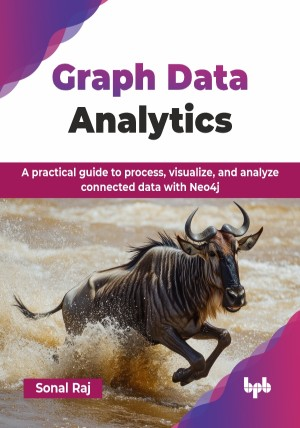

# Graph Data Analytics 

A practical guide to process, visualize, and analyze connected data with Neo4j.

This is the repository for [Graph Data Analytics 
](https://bpbonline.com/products/graph-data-analytics?variant=44267895161032),published by BPB Publications.

## About the Book
For most modern-day data, graph data models are proving to be advantageous since they facilitate a diverse range of data analyses. This has spiked the interest and usage of graph databases, especially Neo4j. We study Neo4j and cypher along with various plugins that augment database capabilities in terms of data types or facilitate applications in data science and machine learning using plugins like graph data science (GDS).

A significant portion of the book is focused on discussing the structure and usage of graph algorithms. Readers will gain insights into well-known algorithms like shortest path, PageRank, or Label Propagation among others, and how one can apply these algorithms in real-world scenarios within a Neo4j graph.

Once readers become acquainted with the various algorithms applicable to graph analysis, we transition to data science problems. Here, we explore how a graph's structure and algorithms can enhance predictive modeling, prediction of connections in the graph, etc. In conclusion, we demonstrate that beyond its prowess in data analysis, Neo4j can be tweaked in a production setup to handle large data sets and queries at scale, allowing more complex and sophisticated analyses to come to life.

## What You Will Learn
• Understand Neo4j graphs and how to effectively query them with cypher.

• Learn to employ graphs for effective search and recommendations around graph data.

• Work with graph algorithms to solve problems like finding paths, centrality metrics, and detection of communities and clusters.

• Explore Neo4j’s GDS library through practical examples.

• Integrate machine learning with Neo4j graphs, covering data prep, feature extraction, and model training.
